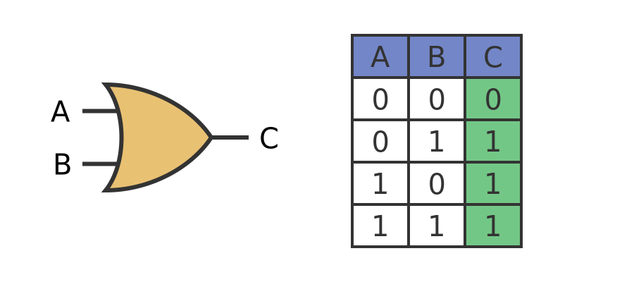

🔌 OR Gate (Built Using NAND + NOT)

🧠 Overview

An OR gate outputs HIGH (1) if either input is HIGH — or if both are HIGH. This is called an inclusive OR Gate, It only returns LOW (0) when both inputs are LOW. In logical terms, this is A OR B.

We can implement this behavior using only NAND gates, by applying De Morgan's Theorem:

A OR B = NOT(NOT A AND NOT B)

This means we can:

Invert A → A NAND A

Invert B → B NAND B

Feed both into a NAND gate: (NOT A) NAND (NOT B)

♻️ How It Works

Take input A, invert it using a NAND gate: A NAND A

Do the same for input B: B NAND B

Pass those two outputs into another NAND gate: (NOT A) NAND (NOT B)

The final result behaves exactly like A OR B.

This OR gate is constructed with three NAND gates — showing once again that NAND gates are truly universal.

📊 Symbol and Truth Table

🖋️ Real-World Analogy

Imagine I have two apples, one in each of my hands. If I hand you one — you have one or the other. If I hand you both — you still have "one or the other" (technically, both). This mirrors the behavior of an OR gate: it only cares that at least one input is present, hence why we call it inclusive OR gate.

📄 What I Learned

How to build an OR gate from NAND gates using De Morgan’s Law

The power of NAND as a universal gate

How simple inversions and compositions build complex logic

A practical way to visualize logical operations through everyday analogies